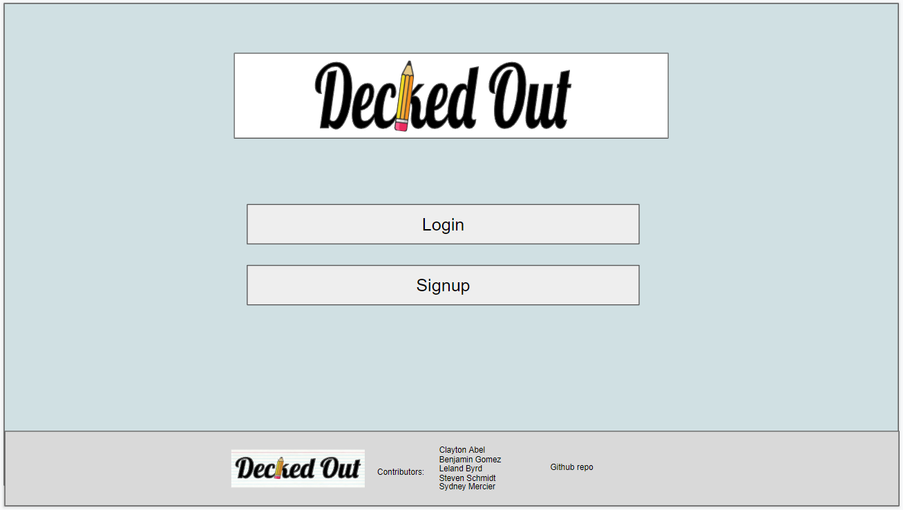
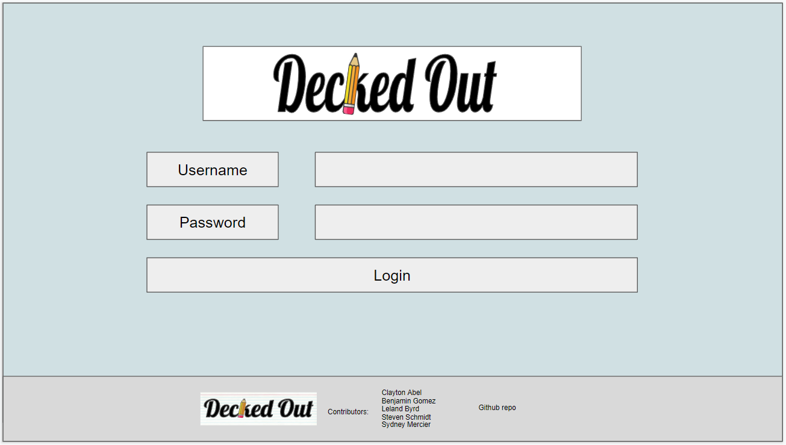
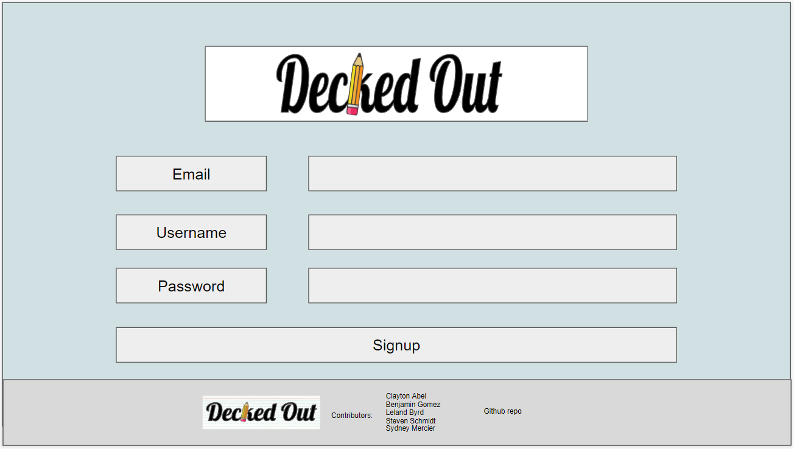

# Decked-Out

Authors: Clayton Abel, Benjamin Gomez, Leland Byrd, Steven Schmidt, Sydney Mercier

Published: [Heroku]()

Link: [Repository](https://github.com/clabel95/Decked-Out)

## Wireframe

### Landing Page

### Login

### Signup

### Home

### User

### Add Deck

### Add Card
![Wireframe depiciting the add card page for the application. On the left are clickable buttons that look like highlighters that display icons for home, user, and add. In the center of the page is a single card that has inputs for side A and side B of the card. At the bottom of the card is a numerical value for what number card out of total deck size the user is working on. To the right of the card are two buttons, the first button is an adition symbol that will allow the user to add another card to the deck. The second button is a Finalize deck button that will save the cards and take the user back to the home page.](./Assets/New_Card_Wire.PNG)

### Study
